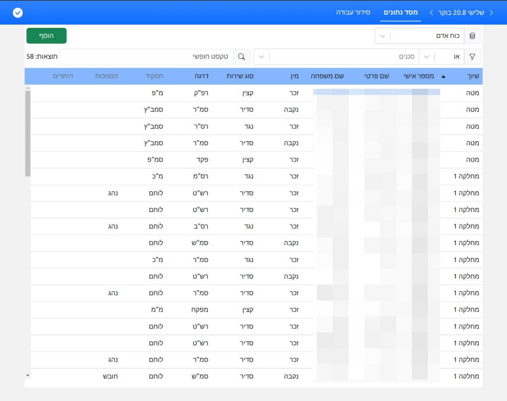
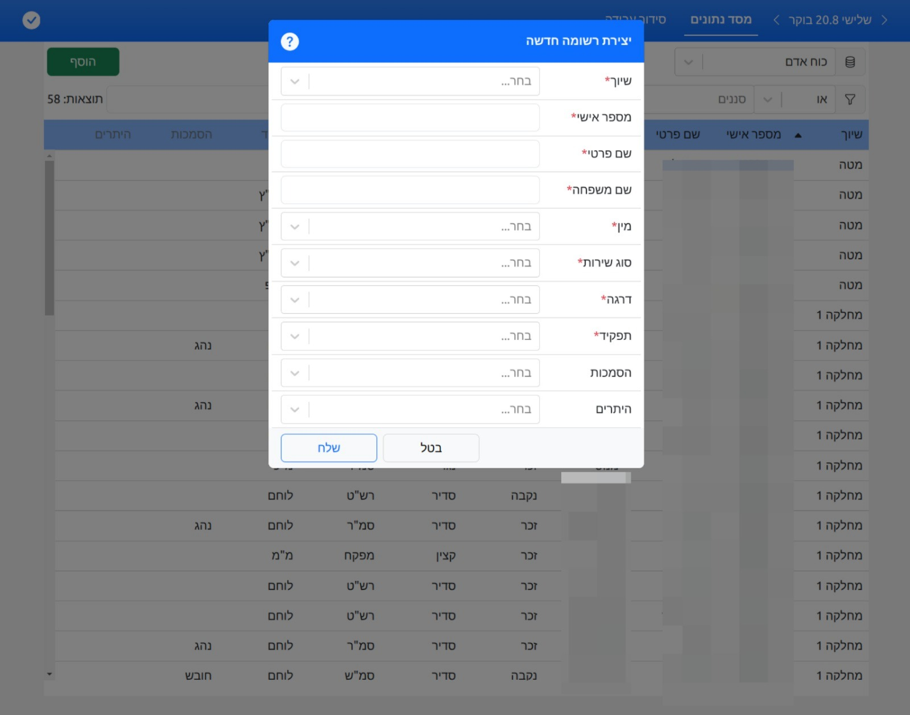

# HR Management App

<!-- {project logo}

 -->

###### Powered by

    
    
    
    
    
    

# About

Manage your human resource with ease using this application.  
Create, edit and assign people to their task duties in a streamlined manner.  

# Demo

  

# License

Licensed under the [GPLv3](./LICENSE).

Copyright (c) 2024 yuval-ro. All rights reserved.
